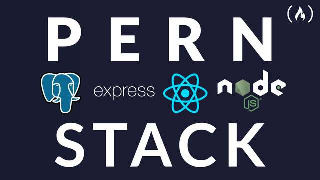
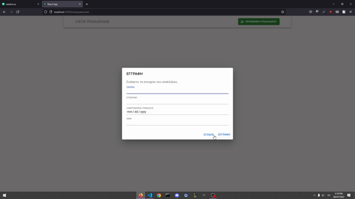

# CRUD-PERN-APP

A CRUD application created with PostgreSQL, Express, React and Node (PERN). It Creates,
Delete, Update and Get company employees.

## Usage
 

## Tech Stack

**Client:** React, MaterialUI

**Server:** Node, Express

## Demo

https://www.loom.com/share/ec198bf557184e70ad6e12961c8b68c8
## Support

For support, email lampispapantoniou@gmail.com .

## Authors

-[@LamprosPapantoniou ](https://github.com/LamprosPapantoniou)

